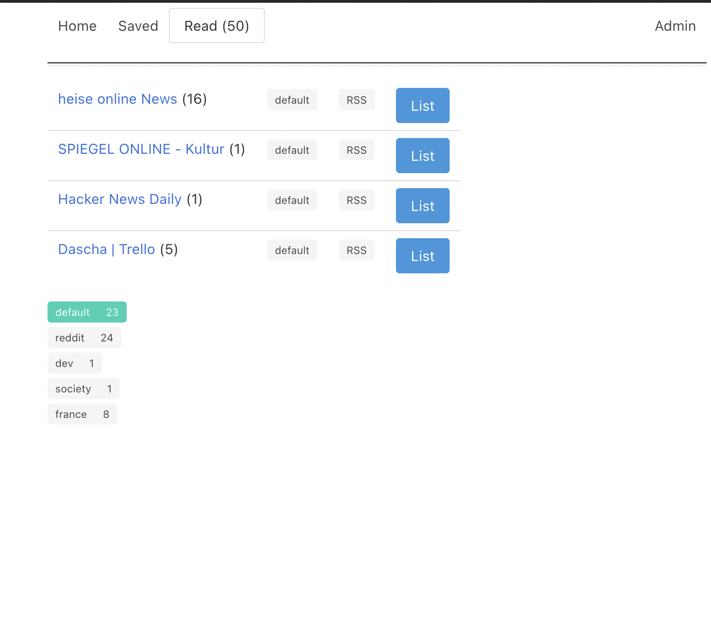

[](https://github.com/maluio/feedo/actions/workflows/tests.yaml)

# Feedo - Personal Feed Reader

**A non-fancy personal feed reader for self-hosting**

## Goals

* Easy + cheap to self-host
  * Low JS (no JS build steps required!)
  * No need for a "big" DB server; uses **SQlite** + [Litestream](https://litestream.io)
* No built-in access control
  * **Access control of main UI must happen on another architecture level**; it is not part of Feedo, but there are recommandations (see section **Architecture**)
  * However, Feedo uses the Django Admin module to manage feeds; [how to create an admin user](https://docs.djangoproject.com/en/4.0/ref/django-admin/#django-admin-createsuperuser)

## Supported Feed Sources

* RSS
* Reddit (using [PRAW](https://praw.readthedocs.io/en/stable/index.html))
* *e-mail (planned)*

## Features

* Import articles from different sources
* Tag your feeds
* Save articles for later

## Screenshots

### UI



### Django Admin


## Requirements

* **Python3**
* **SQlite3**
* A **Reddit account** with subscriptions to the subreddits you'd like to fetch

## Architecture

Feedo doesn't require a specific architecture. Any environment that runs a webserver + python3 code that gets backupped regularly should be fine.

Here are some possible ways to run Feedo:

### Simple hosting


### A bit more sophisticated hosting


## Production

Set the following `env` variables in your production environment:

```bash
# change to your local path!
DB_FILE=/path/to/your/db/feedo.db3
APP_ENV=prod

# Reddit credentials
REDDIT_USERNAME=
REDDIT_PASSWORD=
REDDIT_CLIENT_ID=
REDDIT_CLIENT_SECRET=
```

* If using docker: Create a docker file for Python + uWSGI like [this one](https://github.com/caktus/dockerfile_post/blob/master/Dockerfile)

## Development

Create a `.env` file in the document root with:

```bash
# change to your local path!
DB_FILE=/path/to/your/db/feedo.db3
APP_ENV=dev
# for pytest
DJANGO_SETTINGS_MODULE=config.settings
```

Run:

```bash
$ pip3 install -r requirements.txt
$ ./manage.py runserver
```

## Tests

Run:

```bash
$ pytest
```
