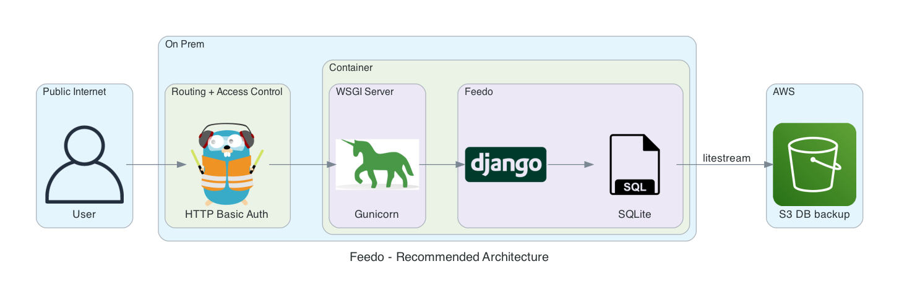

# Feedo - Personal Feed Reader

**A self-hosted, non-fancy, personal feed reader.**

## Goals

* Easy + cheap to self-host
  * low JS (no JS build steps required!)
  * no need for a "big" DB server; uses **SQlite** + [Litestream](https://litestream.io)
* No built-in access control
  * support for only one user
  * no access control built-in (except for Django Admin)
  * **access control must happen on another architecture level**; it is not part of Feedo, but there are recommandations (see section **Architecture**)  

## Supported Feed Sources

* RSS
* Reddit (using [PRAW](https://praw.readthedocs.io/en/stable/index.html))
* e-mail

## Features

* Import articles from different sources
* Tag your feeds
* Save articles for later

## Screenshots

### UI


### Django Admin


## Requirements

* **python3**
* **sqlite3**
* A **Reddit account** with subscriptions of the subreddits you'd like to fetch

## Architecture

Feedo doesn't require a specific architecture. Any environment that runs a webserver + python3 code that gets backupped regularly should be fine.

Here are some possible ways to run Feedo:

### Simple


### A bit more sophisticated



## Production (recommended)

* A docker file for Python + uWSGI like [this one](https://github.com/caktus/dockerfile_post/blob/master/Dockerfile)

## Development

Create a `.env` file in the document root with:

```bash
# change to your local path!
DB_FILE=/path/to/your/db/feedo.db3
APP_ENV=dev
# for pytest
DJANGO_SETTINGS_MODULE=config.settings
```

Run:

```bash
$ pip3 install -r requirements.txt
$ ./manage.py runserver
```

## Tests

Run:

```bash
$ pytest
```